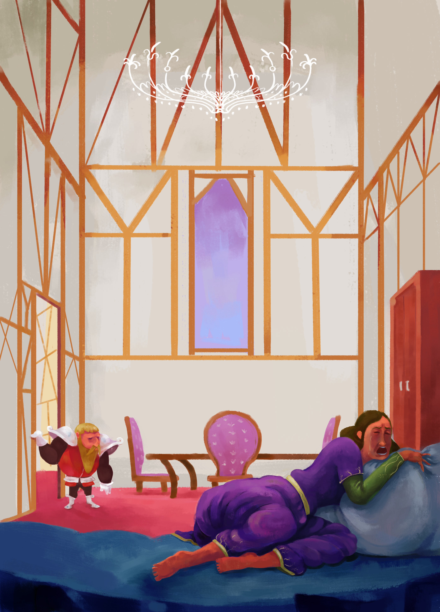

# _O Preço do Flautista_

# Hamelin é uma cidade rica...

...movimentada e próspera, mas sofre Com um problema que ninguém consegue resolver: uma infestação de ratos toma conta das ruas, das casas e dos comércios. 

Énquanto os moradores discutem de quem é a culpa, surge um misterioso flautista que promete eliminar
todos os roedores... em troca de uma recompensa.

Quando a cidade decide não cumprir o acordo, as consequéncias são muito mais graves do que qualquer
poderia imaginar e aquilo que parecia apenas uma disputa por dinheiro transforma-se em uma jornada repleta de desafios, perigos e descobertas.

Entre florestas desconhecidas, mares distantes e segredos antigos, um homem que perdeu tudo
precisará encontrar coragem para enfrentar seus erros e tentar salvar aqueles que mais ama.

Em uma releitura do clássico conto, João Pedro L. Affonso apresenta uma aventura sobre responsabilidade, honra e as consequências das escolhas que fazemos. Uma história para jovens leitores, mas também para qualquer adulto que já tenha desejado colher os frutos sem arcar com os custos.

# Figuras

# Sobre o Autor

João nasceu no Rio de Janeiro (RJ) e foi criado em Araruama (RJ), onde seus pais despertaram nele o   interesse pela leitura, pela história e pela ciência. 

Engenheiro de Telecomunicações, sempre cultivou o amor pela arte de contar histórias, com especial paixão pelos clássicos e pelas lendas da Antiguidade.   

Atualmente, mora em São Paulo, onde trabalha com tecnologia da informação.

# footnotes

